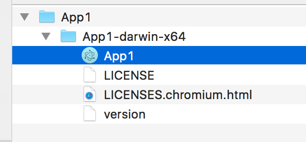

很早就想要用 [Electron][Electron] 來開發 App 了，因為 Web 其實用起來有時候卡卡的  
尤其 [Electron][Electron] 出現之後，開發 Web 等同於開發 App，真是令人感到興奮～  

<!--more-->

## 開始

* 建立一個目錄
* 用 `npm init` 建立 package.json
* 安裝 `electron-prebuilt`

  ```
  npm install --save-dev electron-prebuilt
  ```

## 程式內容

簡單的 Hello World!   

* 先建立 app 目錄
* 產生 `app/index.html` 檔案，內容很簡單！就是 Hello!  

  ```
   <h2>Hello</h2>
  ```
* 建立 `main.js`  

  ```
  'use strict';

  var app = require('app');
  var BrowserWindow = require('browser-window');

  var mainWindow = null;

  app.on('ready', function() {
      mainWindow = new BrowserWindow({
          height: 600,
          width: 800
      });

      mainWindow.loadURL('file://' + __dirname + '/app/index.html');
  });
  ```

## 執行

因為剛剛安裝了 `electron-prebuilt`，所以可以直接用下面的指令就可以執行了！  

```
node_modules/.bin/electron .
```

這樣就可以了～  

## 打包

參考 [electron-packager](https://www.npmjs.com/package/electron-packager)  

* 先安裝 `electron-packager`
* 參考說明文件，用下面的指令來打包自己的 App。（注意那個版本只的是 Electron 版本，不是你自己 App 的版本）

  ```
  $ electron-packager ./ App1 --platform=darwin --arch=x64 --out ~/Desktop/App1 --version 0.36.2 --overwrite
  Packaging app for platform darwin x64 using electron v0.36.2
  Wrote new app to /Users/RickyChiang/Desktop/App1/App1-darwin-x64
  ```

  目前 Electron Release 的版本是 0.36.2，可以到 [https://github.com/atom/electron/releases](https://github.com/atom/electron/releases) 去看  
* `electron-packager` 命令列的說明可以參考 [usage.txt](https://github.com/maxogden/electron-packager/blob/master/usage.txt)
* 到桌面看就會有檔案產生了，點兩下就可以執行了  

   


## 後語

如果要方便執行的話，可以編輯一下 `package.json`

```javascript
{
    "name": "app1",
    "version": "1.0.0",
    "description": "",
    "main": "./main.js",
    "scripts": {
        "start": "electron .",
        "package": "electron-packager ./ App1 --platform=darwin --arch=x64 --out ~/Desktop/App1 --version 0.36.2 --overwrite"
    },
    "devDependencies": {
        "electron-packager": "^5.2.0",
        "electron-prebuilt": "^0.36.2"
    }
}
```

這樣就可以用 `npm start` 執行了～  
編譯的話，就用 `npm run package` 就可以了


[Electron]: http://electron.atom.io
