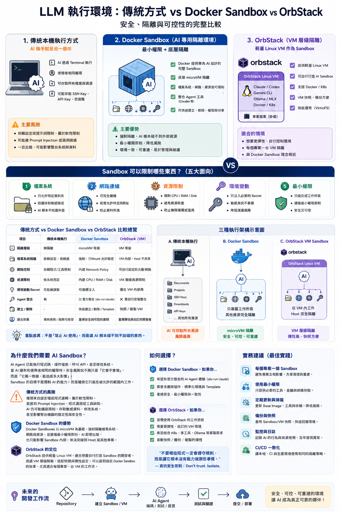

> 從 Docker Sandbox、OrbStack 到 AI Agent 執行環境的設計思維

## 前言

過去幾年，大型語言模型（LLM）快速發展。最初的 AI 工具主要扮演「助手（Assistant）」的角色，協助撰寫程式、回答問題，真正執行的人仍然是開發者。

然而，這個模式正在改變。

<!--more-->

近一年，Claude Code、Codex CLI、Gemini CLI，以及各種 AI Agent 開始具備直接操作 Terminal 的能力。它們可以修改程式碼、執行測試、操作 Git、啟動 Docker，甚至完成整個開發流程。

AI 已經不只是提供建議，而是真正開始「執行工作」。

這也帶來一個新的問題：

> **如果 AI 擁有和工程師一樣的權限，它到底能做到多少事情？**

## AI Agent 的權限，其實就是你的權限

當 AI 透過 Terminal 工作時，它通常繼承目前使用者的權限。

如果你的帳號可以執行：

```bash
git push
kubectl delete namespace production
aws s3 rm --recursive
```

那麼 AI 理論上也可能執行這些指令。

除此之外，它還可能讀取：

- SSH Key
- Git Credential
- API Token
- Environment Variables
- Documents
- Downloads

因此，我們真正需要思考的不是「AI 會不會犯錯」，而是「AI 犯錯時，最多能造成多大的影響」。

## 為什麼只靠 Permission 還不夠？

很多工具都提供了 Permission 或 Policy。

例如：

- 是否允許執行 Shell
- 是否允許修改檔案
- 是否允許使用某個 Tool

這些限制很重要，但它們仍屬於**應用程式層**。

如果遇到 Prompt Injection、工具漏洞或框架缺陷，仍有可能突破這些限制。

資訊安全有一句經典原則：

> **Don't trust. Isolate.**

真正有效的方式，不是相信程式一定會遵守規則，而是讓它根本沒有能力碰到不該碰的資源。

## Sandbox 的核心設計理念

Sandbox 並不是禁止 AI，而是替 AI 建立一個邊界。

AI 可以自由工作，但只能在被允許的空間內。

可限制的範圍包括：

- 檔案系統（Filesystem）
- 網路（Network）
- CPU / Memory / Disk
- Secret 與 Credential
- 最小權限（Least Privilege）

即使 AI 發生錯誤，影響也會被限制在 Sandbox 中。

## Docker Sandbox：把 Container 變成 AI Workspace

Docker Sandbox 並不是重新發明 Container，而是重新定義 Container 的用途。

Container 不再只是部署應用程式，而是 AI Agent 的工作空間（Workspace）。

Docker 會協助建立隔離環境、管理 Secret、限制網路與資源，並與 AI Agent 整合，讓每個專案都能擁有一個可重建、可銷毀且安全的執行環境。

## OrbStack 呢？

OrbStack 並沒有提供 Docker Sandbox 那樣完整的 AI Sandbox 功能。

它的定位仍然是：

- 高效能 Docker Runtime
- Linux VM
- Kubernetes 開發環境

不過，這並不代表它不能建立 Sandbox。

許多工程師會採用「每個專案一台 Linux VM」的方式：

```text
Mac Host
└── OrbStack Linux VM
    ├── Claude Code
    ├── Codex CLI
    ├── Docker
    └── Git Repository
```

AI 完全在 VM 中工作，而 Host 不共享 SSH Key、私人文件與敏感憑證。

雖然需要自行管理，但設計理念與 Docker Sandbox 十分接近。

## Docker Sandbox vs OrbStack

Docker Sandbox 偏向官方提供的一體化 AI Sandbox 平台，整合 Agent、Secret、網路與生命週期管理。

OrbStack 則提供彈性的 Linux VM，由開發者自行建立隔離環境。

如果你希望快速導入 AI Sandbox，Docker Sandbox 會比較方便。

如果你已經熟悉 Docker、Linux VM 與 DevOps，OrbStack 則提供更高的自由度。

## Kubernetes 工程師會很熟悉

如果平常使用 Kubernetes，你會發現許多概念幾乎一致：

| Kubernetes | AI Sandbox |
| --- | --- |
| Pod | AI Workspace |
| Secret | Secret Injection |
| Resource Limit | CPU / RAM Limit |
| Network Policy | Network Restriction |
| Security Context | Least Privilege |

可以說，Docker Sandbox 是把 Kubernetes 的隔離思維延伸到 AI 開發流程。

## 結語

AI Agent 的能力仍在快速成長。

今天它只是修改程式碼，明天可能就會協助部署、維運，甚至操作整個開發流程。

因此，我們需要重新思考的不只是 AI 的能力，而是 AI 的執行環境。

Sandbox 的價值，不在於限制 AI，而是在於建立一個即使 AI 出錯，也能將影響控制在預期範圍內的安全邊界。

未來，「每個 Repository 一個 Sandbox」很可能會像今天的 Git Branch 或 Docker Container 一樣，成為 AI 開發的基本配置。


