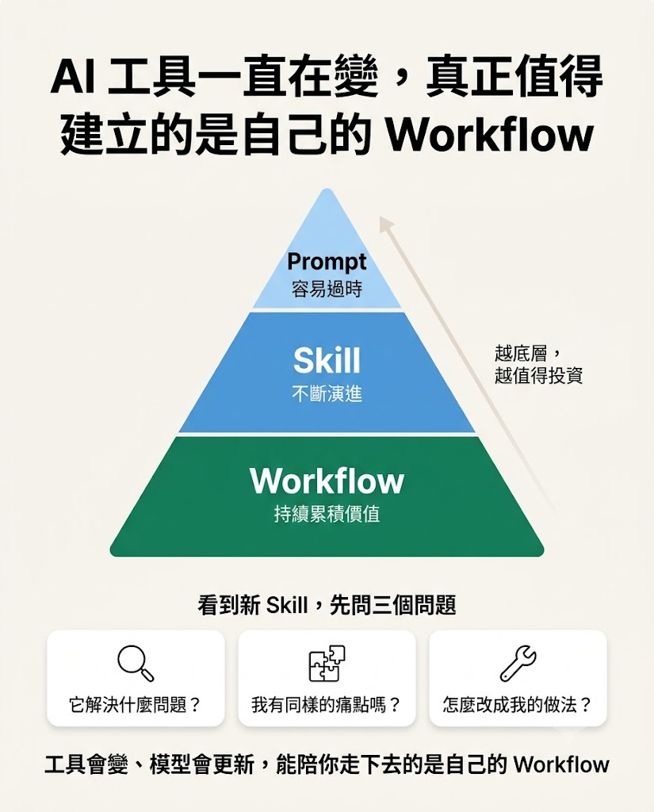

最近滑 X、Reddit、GitHub，幾乎每天都會看到新的 AI 工具、新的 AI Skill。
今天有人分享 Claude Code 的 Best Practices，明天有人分享 Cursor Rules，後天又有人公開自己的 AGENTS.md，接著又出現各種 Prompt Library、Memory、Workflow Template……
每一個看起來都很厲害，也很值得收藏。

但我開始思考一個問題：

> 這些 Skill，真的適合你的工作流程嗎？

<!--more-->

### AI 並沒有推翻以前的方法論

如果回頭看軟體開發的演進，其實會發現一件很有趣的事情。
十幾年前，開發流程可能很單純：

```
需求 → 設計 → 開發 → 測試 → 交付
```

隨著系統越來越大型，開始出現 Scrum、Sprint、Story Point、Stand-up Meeting、Retrospective……
接著測試文化也逐漸成熟：

- Unit Test
- Integration Test
- End-to-End Test
- TDD
- BDD
- CI/CD

每一種方法論，都是為了解決軟體工程不同階段遇到的問題。
而現在，AI 又加入了整個流程，我們開始學習新的名詞：

- Prompt Engineering
- AI Skill
- Memory
- Agent
- MCP
- AGENTS.md
- CLAUDE.md
- Cursor Rules
- Workflow Template

看起來，好像所有東西都必須重新學一次。
但真的是這樣嗎？

我反而越來越認為：

> AI 並沒有淘汰 Scrum，也沒有淘汰 Kanban，更沒有淘汰 Software Engineering。

它只是改變了工作的媒介。
以前是自己寫程式，現在變成：

```
想清楚 → 告訴 AI → Review → 修正
```

Developer 的角色，也從單純的程式開發者，逐漸變成 Developer + Reviewer。

但真正重要的事情沒有改變。例如：

- 需求是否理解正確？
- 系統設計是否合理？
- 功能是否拆解清楚？
- 是否容易維護？
- 是否容易測試？

AI 並不會自動替你回答這些問題。

### Scrum 與 Kanban 的價值，其實還在

很多人會問：

> 有 AI 了，Scrum 還重要嗎？

我認為答案是：

> 重要，而且比以前更重要。

Scrum 的核心價值一直都是：

- 把大型需求拆小
- 持續交付
- 快速取得 Feedback
- 降低開發風險

AI 很擅長完成小而明確的任務，卻不擅長一次完成大型系統。
所以真正重要的不是 AI 有多強，而是：

> 你能不能把問題拆成 AI 能完成的大小。

這其實就是 Scrum 一直在做的事情。
Kanban 也是同樣的概念。

```
Todo → Analysis → Design → Coding → Review → Testing → Deploy → Done
```

AI 加入之後，流程沒有消失。
只是每一個節點，多了一位能力很強的協作者。例如：

| 階段 | AI 的角色 | 人的角色 |
| --- | --- | --- |
| Analysis | 整理需求 | Review |
| Design | 協助設計 | 修正 |
| Coding | 撰寫程式 | Code Review |
| Testing | 產生測試 | 驗證 |

流程依然存在，只是 Human 與 AI 一起完成。

### 真正應該建立的是自己的 Workflow

我現在反而很少收藏別人的 Prompt。
因為我發現：

> Prompt 很容易過時。
> Skill 很容易更新。
> Tool 幾乎每個月都在改變。

但是 Workflow 通常不會因此大幅改變。
例如我的工作流程可能是：

```
需求進來
    ↓
AI 協助整理需求
    ↓
自己確認需求
    ↓
AI 協助切 Ticket
    ↓
自己確認拆解
    ↓
AI 產生 Design
    ↓
Review
    ↓
AI Coding
    ↓
Review
    ↓
AI 補 Unit Test
    ↓
人工測試
    ↓
Merge
```

這才是真正每天都會使用的流程，而不是某一句神奇 Prompt。

### 網路上的 Skill，可以當作素材，不要當作標準答案

現在 GitHub 上有很多優秀的 Repository：

- AGENTS.md
- Cursor Rules
- Claude Code Skills
- Prompt Collection
- MCP Server
- Memory Framework

我現在的做法是：

> 不要直接拿來用。

而是先問自己三個問題：

1. 它解決的是什麼問題？
2. 我的 Workflow 有沒有同樣的痛點？
3. 如果有，我該怎麼修改，才能符合自己的工作方式？

我自己還有一個實際的做法：

> 看到網路上不錯的 Skill，我不會直接照抄，而是把它丟給 AI，請 AI 幫我分析它的優點，以及該怎麼把這些優點融入我自己的 Skill 與流程。

分析、比較、整合，本來就是 AI 擅長的事。
經過這樣消化之後留下來的東西，才是真正屬於自己的。

當 Skill 能真正融入 Workflow，它才會變成自己的能力。
否則，就只是一直收藏新的 Template。

### AI 時代，真正重要的是 Workflow

很多人認為 AI 時代最重要的是 Prompt。
我反而認為：

```
第一層：Prompt
第二層：Skill
第三層：Workflow
```

真正能持續累積價值的，是 Workflow。

因為 AI 可以寫程式，但它不知道：

- 系統應該怎麼拆。
- 團隊如何協作。
- 哪些需求應該優先。
- 哪些技術債值得先處理。

這些依然需要工程師判斷。

### 結語

AI 正在快速改變開發方式。
但它沒有推翻過去二十多年累積下來的軟體工程經驗。

需求分析、系統設計、問題拆解、持續交付、Code Review……
這些能力依然存在。
不同的是，我們現在多了一位能力很強的協作者。

所以，比起每天追逐新的 AI Skill，我更建議花時間建立一套真正屬於自己的 Workflow。

因為工具會一直變，模型會一直更新，Skill 也會一直演進。

真正值得建立的，是一套能隨著工具演進、不斷優化的 Workflow。

<!-- 檔名刻意不用 cover/feature，避免 Congo 自動把它當成 featured image
     顯示在標題下方，變成跟這裡重複出現兩次。 -->

