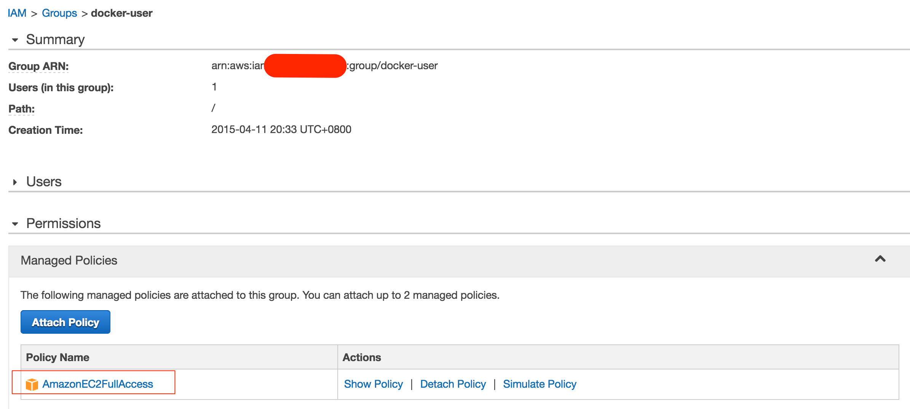
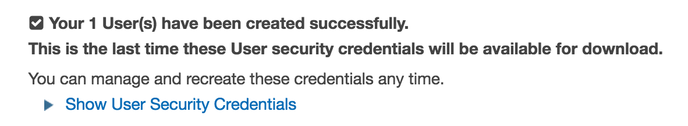
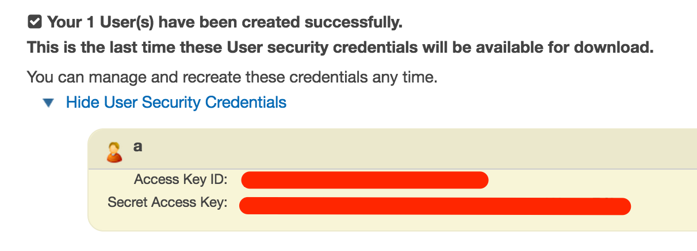
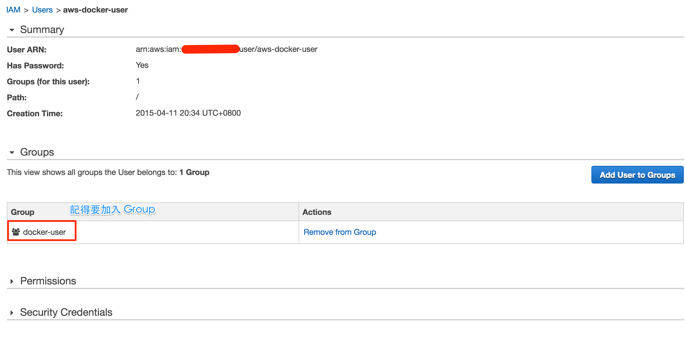
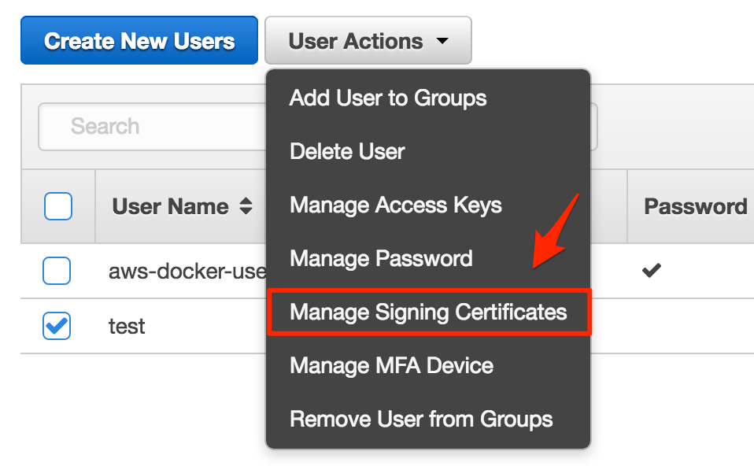
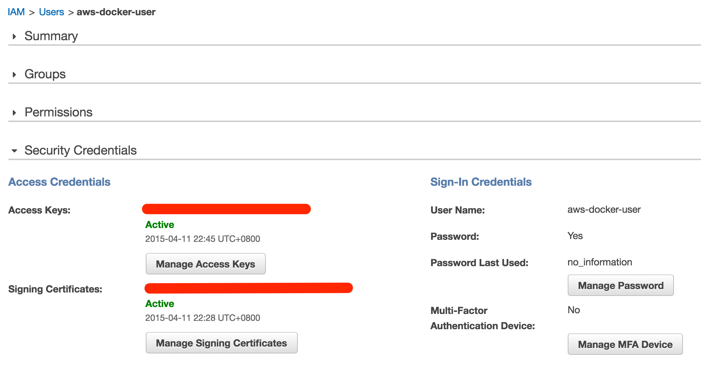
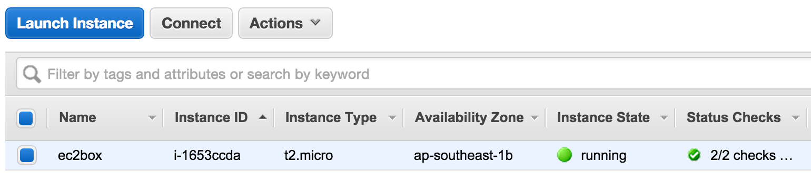

前兩天在公司上了 Introduction Docker 的課程，回家就來試驗新的 docker-machine   
花了一點時間，研究了怎樣連接到 [AWS] 去～  

<!--more-->

如果你打 `docker-machine create` 這個指令，大概就會出現以下的資料，告訴你要打的參數  

```shell
NAME:
   create - Create a machine

USAGE:
   command create [command options] [arguments...]

OPTIONS:
   --amazonec2-access-key 												AWS Access Key [$AWS_ACCESS_KEY_ID]
   --amazonec2-ami 													AWS machine image [$AWS_AMI]
   --amazonec2-iam-instance-profile 											AWS IAM Instance Profile
   --amazonec2-instance-type "t2.micro"											AWS instance type [$AWS_INSTANCE_TYPE]
   --amazonec2-region "us-east-1"											AWS region [$AWS_DEFAULT_REGION]
   --amazonec2-root-size "16"												AWS root disk size (in GB) [$AWS_ROOT_SIZE]
   --amazonec2-secret-key 												AWS Secret Key [$AWS_SECRET_ACCESS_KEY]
   --amazonec2-security-group "docker-machine"										AWS VPC security group [$AWS_SECURITY_GROUP]
   --amazonec2-session-token 												AWS Session Token [$AWS_SESSION_TOKEN]
   --amazonec2-subnet-id 												AWS VPC subnet id [$AWS_SUBNET_ID]
   --amazonec2-vpc-id 													AWS VPC id [$AWS_VPC_ID]
   --amazonec2-zone "a"													AWS zone for instance (i.e. a,b,c,d,e) [$AWS_ZONE]  
```

最前面的，就是 aws 所需要的參數。  
我找了一下網路的文章，發現這篇是有比較多的說明，針對 docker-machine provider 的部份  

[http://flurdy.com/docs/docker/docker_compose_machine_swarm_cloud.html]()  

按照這篇文章的作法，大概只需要以下的參數就可以  

```shell
docker-machine create \
--driver amazonec2 \
--amazonec2-access-key your-aws-access-key \
--amazonec2-secret-key your-aws-secret-key \
--amazonec2-vpc-id your-aws-vpc-id \
--amazonec2-subnet-id your-aws-subnet-id \
--amazonec2-region us-east-1 \
--amazonec2-zone a \
ec2box
```

不過因為我是新手，所以嘗試了蠻多次才找到這些參數到哪邊去做  

## Access Key/Secret Key

這部份我嘗試最久，因為我其實搞不太懂這是要到哪裡去抓，後來才知道這是要到 [IAM] 去做的。  

### Create a group
進到 [IAM] 之後，先建立一個 Group，步驟很簡單，只要輸入名稱以及選擇 Policy 就好了  
名稱隨便 (我是叫 docker-user)  
然後記得加入 Policy，我是加入 AmazonEC2FullAccess (也可以給他 Administrator)  

建立之後，Group 的資料大概像這樣:    


### Create a user

接下來建立一個 User， 你一次可以建立五個 User，不過我是先建立一個，接下來的畫面，蠻重要的，他會給你這個 User 的 Security Credentials，這就是我們要的資料了！  

Access Key ID 對應的就是 --amazonec2-access-key 參數  
Secret Access Key 對應的就是 --amazonec2-secret-key 參數  



這邊你可以點選 "Show User Security Credentials" 來顯示 Access Key ID 以及 Security Access Key，或者是點選畫面下方的 "Download Credentials" 把檔案下載下來再看都可以  



建立完 User 之後，記得把這個 User 加入到上面我們建立的 Group 去，之後才有權限可以使用 EC2  



### Generate AWS Signing Certificates

這個步驟也蠻重要的，因為如果你不做這個步驟，其實你建立的 User 是不能呼叫 EC2 的 Web Service 的 (我碰壁了很久.....)  

我參考了這篇文章  
[http://www.markbartel.ca/2012/04/creating-key-pairs-for-amazon-ec2.html]()  

先執行    

```shell
openssl req -x509 -newkey rsa:2048 -passout pass:a -keyout kx -out cert
```
這個步驟是在建立 ssl 證書資料，會需要你填一些東西  

```shell
Country Name (2 letter code) [AU]: [這邊我是填 TW]
State or Province Name (full name) [Some-State]: [這邊我是填 Taiwan]
Locality Name (eg, city) []: [這邊我是填 Taipei]
Organization Name (eg, company) [Internet Widgits Pty Ltd]:
Organizational Unit Name (eg, section) []:
Common Name (e.g. server FQDN or YOUR name) []:
Email Address []: [這邊填電子郵件]
```
沒填的地方我是直接 Enter 就過去了～  
這樣會產生 kx, cert 檔案

然後執行以下步驟  

 ```shell
 openssl rsa -passin pass:a -in kx -out key
 ```
這個步驟會產生 key 檔案

不過我們主要是要用到 cert 這個檔案 (目前我還不知道其他檔案的用途，不過還是建議先保留下來～)  

選擇剛剛建立的 User，選擇 Manage Security Credentials 功能，準備上傳 cert 資料  



進去功能的第一個畫面是一些說明，你可以直接到下一步驟，把 cert 檔案內容貼到下一個畫面的 Certificate Body 格子內，然後按下 "Upload Signing Certificate" 按鈕就好 ...   

如果一切都順利完成，User 的資料就應該像是下面這樣，  


這樣，你就可以往下面做了～  

 ## Vpc-ID

到 [EC2] 的介面，去抓到 default security group 的 vpc-id  
這就是我們要用的 --amazonec2-vpc-id  

 ## Subnet-ID

到 [EC2] 的介面，到 Network Interfaces 功能，建立一組新的 Network Interface。  
(因為蠻簡單的，都用預設值就可以)  
然後，找到 subnet-id   
這就是 --amazonec2-subnet-id 參數  

> 2014-04-12 14:50 更正：
> 根據 Docker 官網文件，以及實際測試結果，其實，subnet-id 並不是必要條件，所以，其實可以不要輸入～這也就是我為什麼之前有個疑問是，我自己建立了一個 Network Interface，他卻又會另外建立一個新的 Network Interface 了～我本來以為 subnet-id 是要我提供的～

## Create a new docker-machine

把之前的步驟找到的所有參數，組合在一起  
至於 --amazonec2-region ，你可以到 [Regions and Avaliable Zones](http://docs.aws.amazon.com/AWSEC2/latest/UserGuide/using-regions-availability-zones.html) 文件中自己去挑選你喜歡的地方  
而 --amazonec2-zone，你是要進入到該 region 的 [EC2] Dashboard 介面去看他 Service Health 的部份，會告訴你有哪些 Available Zones  

像我是挑 Singapore，就是 ap-southeast-1   
Zone 的話，我是挑了 b zone  

就像這樣～  
```shell
docker-machine create \
--driver amazonec2 \
--amazonec2-access-key [Access Key ID] \
--amazonec2-secret-key [Secret Access Key] \
--amazonec2-vpc-id [Default SecurityGroup VPC ID] \
--amazonec2-region ap-southeast-1 \
--amazonec2-zone b \
ec2box
```

最後面的 ec2box 是你要給 docker-machine 的名稱，如果一切都 ok，做完之後你在 [EC2] 內就會看到一組建立好的 t2.micro instance。  

  

## 玩完回收

```shell
docker-machine rm -f ec2box
```

這個指令會把之前建立的 ec2 instance 以及相關的設定都刪掉    
因為 [AWS] 要錢，所以～如果你只是玩玩就好，記得刪掉～  
否則收到帳單，我也沒辦法.....   

## 建立時可能發生的問題

如果建立時，發生任何問題，沒有建立成功，你可能都要注意以下事情

1. 有可能 docker-machine 資料已經建立，但是無法連上 [EC2]，這樣的話，你需要自己手動刪除 docker-machine，指令是 `docker-machine rm -f ec2box`。你可以先用 `docker-machine ls` 檢查一下～    
2. 每次建立的時候，docker-machine 會與 [EC2] 交換 key-pair，所以如果建立到一半失敗，你得先自己手動到 [EC2] 把 ec2box 這個 keypair 刪掉再重新建立，不然就會發生 keypair 重複的問題。
3. 如果發生 401 的錯誤，請檢查使用者的資料設定是否有問題 (是說按照步驟來應該可以)。  
4. 你給的 vpc-id 一定要是你建立那個 region/zone 的 default security group vpc-id，不然會告訴你沒有這個 vpc-id

## 參考文件

- [https://docs.docker.com/machine/?hc_location=ufi#amazon-web-services]()

[AWS]: https://aws.amazon.com/tw/
[IAM]: https://console.aws.amazon.com/iam/home
[EC2]: https://console.aws.amazon.com/ec2/v2/home
