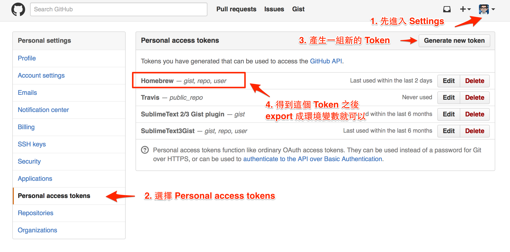

早上使用 brew 發生錯誤  

<!--more-->

```bash
> brew update
Error: GitHub API rate limit exceeded for xxx.xxx.xxx.xxx. (But here's the good news: Authenticated requests get a higher rate limit. Check out the documentation for more details.)
Try again in 11 minutes 49 seconds, or create an personal access token:
  https://github.com/settings/tokens
and then set it as HOMEBREW_GITHUB_API_TOKEN.
```

找了一下資料，估計是因為之前 Github 被攻擊，所採取的一個必要的限流措施   
我覺得不錯  

這個處理方式很簡單，網路上已經有人做出[解釋](https://gist.github.com/christopheranderton/8644743)了～  



接下來你只要把產生的 Token，設定成環境變數就可以  (請用自己產生的 Token ，這邊只是示意～)

```bash
export HOMEBREW_GITHUB_API_TOKEN=9927d2878ffa105fc5236c762f2fd7zfd28b841d
```
