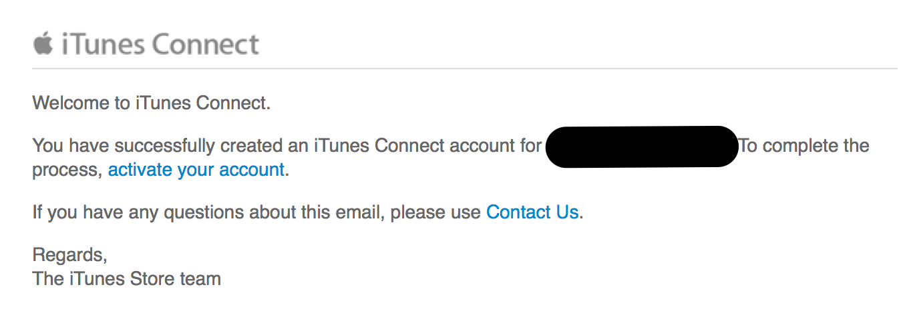
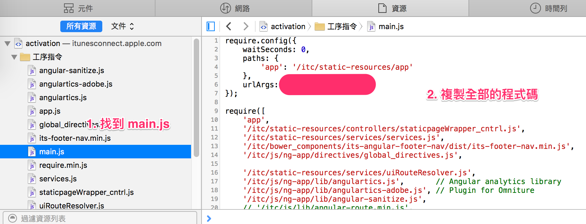
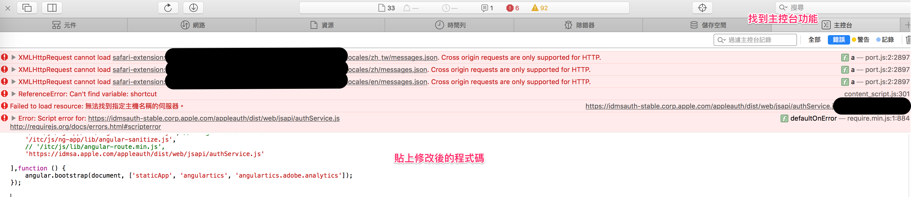
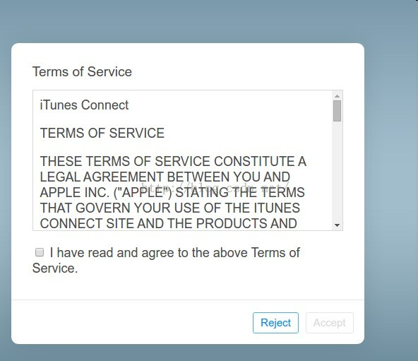

為了要開發 App 上架，要設定 iTune Connect，收到了 Apple 這邊寄來的信，準備啟用

<!--more-->



點選了啟用連結 (activate your account) 之後，結果發生了兩光的問題！  
畫面一片空白！  

## 問題處理

後來找到 [http://blog.csdn.net/iroycn/article/details/49095069]() 發現有人已經遇過這個問題了  
問題其實就是，這個網頁其中一個最重要的 js 無法取到，可以打開網頁主控台就可以看到錯誤    

```
https://idmsauth-stable.corp.apple.com/appleauth/dist/web/jsapi/authService.js?cache=xxxxxxx
```

就是 idmsauth-stable.corp.apple.com 解析不到！  因為這個網址不是公開的網址 (?)  

在 Apple 的論壇也有說明：  
* https://forums.developer.apple.com/message/73056#73056
* https://forums.developer.apple.com/message/73434#73434  

## 解決方法

* 先打開 Safari 的 『顯示網頁資源』功能   
  
* 找到 main.js，然後複製 main.js 所有的程式。
* 然後找到裡面 `idmsauth-stable.corp.apple.com` 的網址，改成 `idmsa.apple.com`  
* 然後把改過的程式碼貼到主控台 
* 接下來就可以看到這個畫面  
  
* 同意之後，就算是成功了！

## 結語

為什麼 Apple 會出這種包呢？  
