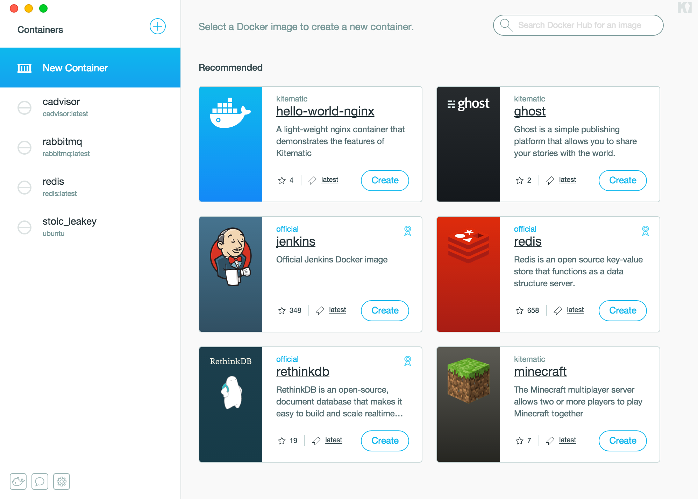

上個月底的新聞：  
[Docker 收購新創公司 Kitematic：讓 Mac 電腦輕鬆部署容器](http://www.ithome.com.tw/news/94527)  

<!--more-->

官方網站: [Kitematic]

會幫你裝 Virtualbox，下載 boot2docker.iso，設定一個 dev 的 docker-machine~  
然後直接可以用！   
只要透過他的介面搜尋你要的 docker image name，就可以直接使用～  

我其實對這個 [Kitematic] 有興趣是因為，他是用 [Atom-Shell] 跟 [Reactjs] 做出來的！！！  
所以 Source Code 應該是很有研究價值的～  

Github: [https://github.com/kitematic/kitematic]()

[Kitematic]: https://kitematic.com/
[Atom-Shell]: https://github.com/atom/atom-shell
[Reactjs]: http://reactjs.com
