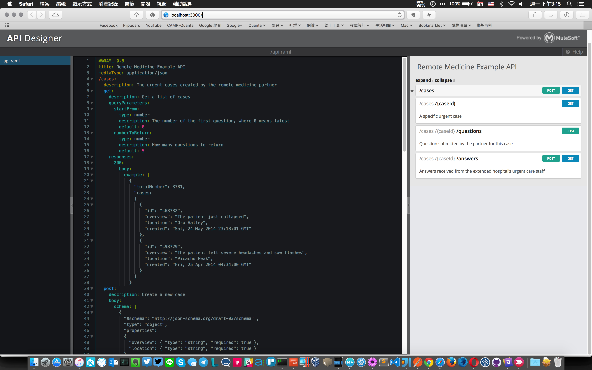
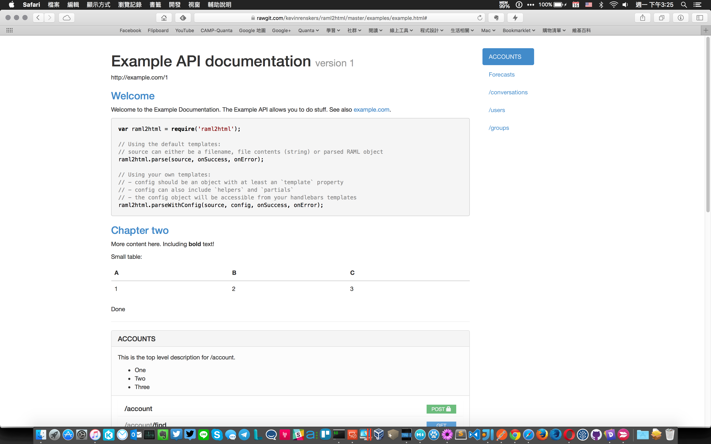

寫文件大概是工程師最討厭的事情，沒有之一

<!--more-->

## 前言

為了要寫份好看、易懂的 API 文件，如果用現在比較習慣的 Markdown 語法來寫，還需要去找格式要怎樣定義。  
這對工程師來說，實在是莫大的折磨。老實說，這比要我寫測試案例還難～  

所以找了網路上有關 REST API 文件規格的資料，找到了這篇文章 [Why You Should Use Markdown for Your API Documentation](http://www.programmableweb.com/news/why-you-should-use-markdown-your-api-documentation/2015/02/19)  
其中提到了 [RAML](http://raml.org) - RESTful API Modeling Language  

因為我 API 是已經寫好的狀況，所以並沒有使用到它與 Source Code 結合的部分，所以只是單純的自己根據之前定的規格，把文件寫出來，並且要加上一些簡單的操作說明  
當然我希望這些也都是用 Markdown 的語法來寫  

## 開始

要開始做，當然是先看別人的範例怎麼做，直接參考！  
由於我後續要把規格轉換成文件，所以我找到了 [raml2html](https://github.com/kevinrenskers/raml2html) 的工具，而這個工具的 Example 相當的詳細！值得參考  

接下來，你可以到 [Design Your API](http://raml.org/developers/design-your-api) 這個頁面，去下載 [API Designer](https://github.com/mulesoft/api-designer)  
有裝 npm 的人可以直接用以下指令就安裝好了  

```
npm install -g api-designer
```

安裝完之後，執行 `api-designer` 指令，然後開啟瀏覽器，打開 `http://localhost:3000`，就可以看到類似下面的畫面了！  



透過這個 Api Designer 的 UI，可以很簡單的看出你編輯的 RAML 格式是否正確，如果不正確，這個 UI 就會提醒你錯誤發生的地方，並且在你編輯完後可以直接預覽～  
(這邊不介紹這個 UI 的使用～～～)  

更新：  
根據 [Editor File System](https://github.com/mulesoft/api-designer/blob/master/docs/file-system.md) 這份文件說的，以及看了一下我自己瀏覽器的設定，才發現，這個 api designer 是把資料存在 LocalStorage 中  
所以，它並不是把資料存在 server 端。  

這有個好處是，大家可以共用同樣的 api designer UI 來編輯自己的文件格式，不用擔心會被別人改到  
不過壞處也是一樣，別人無法編輯～  

不過，根據這個好處，表示其實我可以很安心的自己做一個 docker image  
這樣方便其他人使用  

有需要的人可以自己下載～  (因為是用 alpine 為 base，所以只有 48.86 MB)  
[https://github.com/metavige/alpine-api-designer]()

## 轉換 HTML

寫完 [RAML](http://raml.org) 之後還是需要轉換成 HTML 才好看，所以透過 [raml2html](https://github.com/kevinrenskers/raml2html) 工具，先用 npm 安裝：  

```
npm i -g raml2html
```

然後透過指令去轉換：  

```
raml2html -i example.raml -o example.html
```

如果你寫的很豐富，結果可能就會像是 raml2html 的範例一樣



## 結語

現在我自己使用還有遇到一些問題，不過，整體來說，產出的內容我自己是還蠻滿意的  
格式也算不難看，當然，文件內容本身還需要傷腦筋一下，畢竟文件是要給人看的，內容部分其實還蠻重要的！  

目前我使用的是 RAML 0.8 的版本，我想應該就夠了
因為 RAML 1.0 好像是新的，不知道新的會不會有什麼問題，我也沒多加研究  

之後等到文件內容都寫完了，再來研究自動化的部份以及新的 RAML 1.0 規格，像是不是可以結合 CI (Jenkins) ?  

## Reference

* [RAML 0.8](https://github.com/raml-org/raml-spec/blob/master/raml-0.8.md)
* [RAML 1.0](http://docs.raml.org/specs/1.0/)
