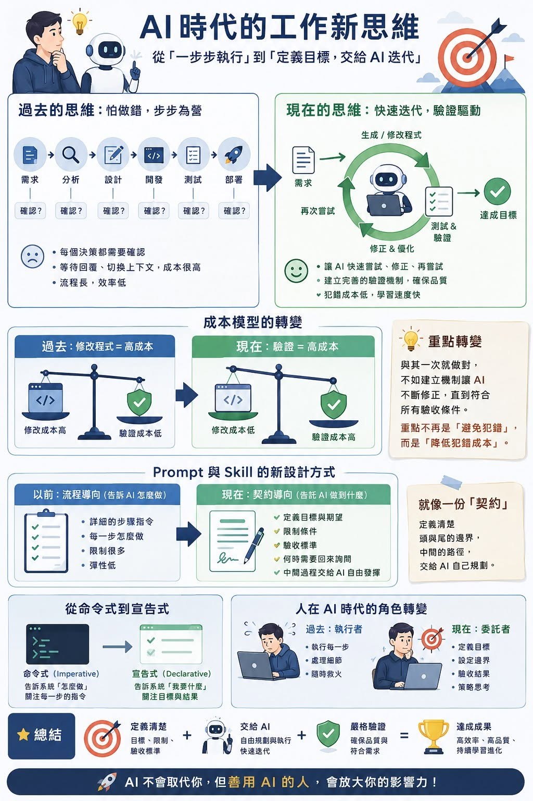

最近在重新設計 AI Agent 的 Skill，有一個蠻大的體悟。

<!--more-->

### 真正昂貴的不是 AI 多想幾輪

以前我們總是很怕第一步做錯，所以在流程裡加了很多確認點，一步一步小心翼翼。
但現在我反而覺得，真正昂貴的不是 AI 多想幾輪，而是每一次等待人回覆、切換上下文所造成的中斷成本。

### 成本模型已經改變

更有趣的是，我發現整個成本模型其實已經改變了。
以前，修改程式是一件昂貴的事情，所以我們希望一開始就把方向決定好。
現在，有了 AI Agent，程式修改的成本大幅降低。
真正昂貴的，反而變成「驗證」。
也就是，如何確認它沒有改壞、沒有引入新的問題，以及最終是否真的符合需求。

### 與其一次做對，不如讓犯錯夠便宜

因此，與其要求 Agent 一次就做對，不如建立一套完善的驗證機制。
讓它可以一直嘗試、一直修正，直到所有測試都通過、所有驗收條件都滿足。
重點不再是「避免犯錯」，而是「讓犯錯的成本足夠低」。

### 把 Prompt 寫成契約

這也讓我重新思考 Prompt 與 Skill 的設計方式。
以前，我們習慣把流程寫得非常詳細，每一步都規定該怎麼做。
現在，我更傾向把它設計成一份「契約」。
定義清楚目標、限制、驗收標準，以及哪些情況一定要回來詢問我。
至於中間如何完成，就交給 Agent 自己發揮。

### 從命令式到宣告式

這其實很像軟體工程一路走來的演進。
從命令式（Imperative）逐漸走向宣告式（Declarative）。
我們不再告訴系統「怎麼做」，而是告訴它「我要什麼」。

### 從執行者變成委託者

我覺得，人在 AI 時代的角色也正在改變。
我們慢慢從每一步的執行者，變成設定目標與邊界的委託者。
真正重要的，不再是設計每一個流程細節。
而是定義清楚起點、終點、限制，以及驗收標準。
剩下的，就交給 Agent 不斷迭代，直到達成我們真正想要的結果。

<!-- 檔名刻意不用 cover/feature，避免 Congo 自動把它當成 featured image
     顯示在標題下方，變成跟這裡重複出現兩次。 -->

